### 语法

###### #单行注释

’‘’多行注释‘’‘   

保留字

| and      | elif    | import | raise  | global   |
| -------- | ------- | ------ | :----: | -------- |
| as       | else    | in     | return | nonlocal |
| assert   | except  | is     |  try   | True     |
| break    | finally | lambda | while  | False    |
| class    | for     | not    |  with  | None     |
| continue | from    | or     | yield  |          |
| def      | if      | pass   |  del   |          |

整型：0101001

字符型：‘101,101.001’

列表类型：[10,011,101]

字符串的序号

正向递增序号（0，1，2）和反向递减序号（-1，-2）

使用[]获取字符串中一个或多个字符

###### 索引：返回字符串中单个字符 <字符串>[M]

"请输入带有符号的温度值："[0] 或者 TempStr[-1]

###### 切片：返回字符串中一段字符子串 <字符串>[M:N]

“请输入带有符号的温度值：”[1:3]  从1到2不到3 或者 TempStr[0:-1] 除最后一个字符的字符串

使用保留字in判断一个元素是否在列表中

TempStr [-1] in [‘C’,'c']  判断前者是否与列表中某个元素相同

print("转换后的温度{:.2f}C".format(C))

{}表示槽，后续变量填充到槽中

{:.2f}表示将变量C填充到这个位置时取小数点后2位

## eval()	

###### 去掉参数最外侧引号并执行余下语句的函数

eval（‘ ’‘1+2’‘ ’）			  ‘1+2’	

 eval（“1”）				 1 

eval（“1+2”）			 3

eval（‘print（“hello”）’）  hello

条件输出：

n = eval(input("请输入一个整数"))

if n == 0:

print("Hello World")

elif n > 0:
    print("He\nll\no \nWo\nrl\nd")
else:
    for c in "Hello World":
        print(c)

######TempConvert.py
TemStr=input("请输入带有符号的温度")
if TemStr [-1] in ['F','f']:
    C=(eval(TemStr[0:-1])-32)/1.8
    print("转换后的温度{:.2f}C".format(C))
elif TemStr[-1] in['C','c']:
        F=1.8*eval(TemStr[0:-1])+32
        print("转换后的温度{:.2f}F".format(F))
else:
         print("输入格式错误")

###### turtle的绘图窗体（以电脑屏幕为参照）

turtle.setup(width,height,startx,starty)设置窗体大小及位置 宽高 xy轴 默认居中

###### turtle的空间坐标系  （以画布为参照）

turtle.goto(startx,starty)设置画布xy轴 

turtle.circle(r,range)表示以海归当前位置左侧为圆心曲线运动

turtle.bk(d)表示向海龟的反方向运行,只能后退，但不改变方向，"后退"不是"转向"。

turtle.fd(d)表示向海龟的正方向运行

###### turtle的角度坐标系  （以画布为参照）

###### 角度坐标系的绝对0度方向是右侧


turtle.seth(angle)改变海归行进方向，只改变方向但不行进，angle为绝对度数

turtle.left(angle) turtle.right(angle)

###### turtle.colormode(mode)RGB色彩模式

1.0：rgb小数值模式

256：rgb整数模式

#### import的更多￥法

使用from和import保留字共同完成

1.import：

​	import<库名>

​	<库名>.<函数名>（<函数参数>)

不会出现函数重名的问题

2.from：

​	from<库名>import<函数名>

​	from<库名>import*

​	<函数名>（<函数参数>）

库中函数名字可能会和用户指定值的名字冲突

3.使用import和as保留字共同完成

​	import<库名>as<库别名>

​	<库别名>.<函数名>（<函数参数>)

##### 画笔控制函数：画笔操作后一直有效，一般成对出现

turtle.penup()   	 别名turtle.pu(),  turtle.up()抬起画笔，海归在飞行,turtle.pendown()只是放下画笔，并不绘制任何内容。

turtle.pendown()	 别名 turtle.pd()落下画笔，海归在爬行

turtle.pensize(width)   	 别名  turtle.width(width)画笔宽度，海归的腰围

turtle.pencolor(color)	 color为颜色字符或r，g，b值，画笔颜色，海归在涂装

pencolor(color)的coor的三种形式

颜色字符串：turtle.pencolor("purple")

RGB的小数值：turtle.pencolor(0.63,0.13,0.94)

RGB的原组值：turtle.pencolor((0.63,0.13,0.94))

###### 运动控制函数：控制海龟行进：走直线&走曲线

turtle.circle(radius,extent=None)根据半径r绘制extent角度的弧形

-r默认圆心在海归左侧r距离的位置 -extent：绘制角度，默认是360度整园

circle(x, y) 表示 以x长度为半径，y为角度，当前方向左侧x出为圆心，画圆。其中x和y都可以是负数，相应取反。

```
turtle.circle(-90,90)#绘制一个半径为90像素的弧形，圆心在小海龟当前行进的右侧
```

turtle.circle(100)圆turtle.circle(-100,90)四分之一圆

turtle.forward(d) 别名turtle.fd(d)  向前行进，海归走直线 -d：行进距离，可以为负数 画笔设置后一直有效，直至下次重新设置

###### 方向控制函数 控制海归面对方向

turtle.setheading(angle)别名turtle.seth(angle)改变海归行进方向，只改变方向但不行进，angle为绝对度数

###### 循环语句：按照一定次数循环执行一组语句

for<变量> in range (<次数>)：

​	<循环被执行的语句>

<变量>表示每次循环的计数，0到<次数>-1

range (N)：产生0到N-1的整数序列，共N个 		range（5）   0,1,2,3,4

range (m,n)：产生M到N-1的整数序列，共N-M个    range（2,5）2,3,4

##### 数值类型和运算

##### 整数类型，

pow(x,y):计算x的y次方

十进制

二进制0B开头

八进制0O开头

十六进制0X开头

二进制：0b 或 0B 开头

八进制：0o 或 0O 开头

十六进制：0x 或 0X 开头

## 浮点类型(存在不确定尾数)

0.1+0.2==0.3 false

round(0.1+0.2==0.3)true

使用字母e或E作为幂的符号，以10为基数

<a>e<b>		a*10b次方

4.3 e -3  0.0043

## 复数类型

x²=-1   -a+bj

### 运算符

##### /除 //整数除

+x x本身 -y y的负值	

%余数

 x**y开方

x op =y              op二元运算符

x=3.14115

x  * *=3   等于x=x * *3

31.00627

整数 ->浮点数 ->复数

abs(x) ,x的绝对值

divmod（x,y）商余（x//y,x%y）同时输出商和余数

pow（x，y[，z]）幂余，（x**y）%z，[..]表示参数z可省略

pow（3，pow（3,99）10000）   4587

Round（x,y）进行判断，对x四舍五入，d是小数截取位数

max（x,y,z,o）最大值

min（x,y,z,o）最小值

如果希望在字符串中包含双引号或单引号

‘这里有个双引号（“）’或者”这里有个单引号（‘）“

如果希望在字符串中包含双引号和单引号

‘‘’这里有个双引号（“）又有个单引号（‘）’‘’

### 切片高级用法

使用<字符串>[M:N]，M缺失表示至开头，N缺失表示至结尾

“0123456789”[：3]结果是“012”

<字符串>[M:N:K],根据步长K对字符串切片

“0123456789”[1:8:2]结果是“1357”

利于切片倒序输出

“0123456789”[::-1]结果是“9876543210”

s[N:M]表示对字符串s的切片操作，从N到M，但不包含M

## 特殊字符

转义符\

”这里有个双引号（\“）“

“\b”回退“

\n”换行（光标移动到下行首）

“\r回车”（光标移动到本行首）

### 字符串操作符

有0个或多个字符组成的有序字符序列

| 操作符及使用     | 描述                        |
| ---------- | ------------------------- |
| x + y      | 连接两个字符串x和y                |
| n*x 或 x *n | 复制n次字符串                   |
| x in s     | 如果x是s的子串，返回True，否则返回False |

#### 字符串处理函数

一些以函数形式提供的字符串处理功能

| 函数及使用         | 描述                                       |
| ------------- | ---------------------------------------- |
| len(x)        | 长度，返回字符串x的长度len("一二三456")结果为6            |
| str(x)        | 任意类型x所对应字符创形式str(1.23)结果是“1.23”str([1,2])结果为“[1,2]” |
| hex(x)或oct(x) | 整数x的十六进制或八进制小写形式字符串hex(425)结果是“0x1a9”   oct(425)结果为“0o651” |
| chr(u)        | u为Unicode编码，返回其对应的字符                     |
| ord(x)        | x为字符，返回其对应的Unicode编码                     |

Unicode编码：Python字符串的编码方式

len(str(val))首先通过str(val)将数字类型val变成字符串，再通过len()获得字符串长度，即val的数字个数。

# 字符串处理方法

| 方法及使用                        | 描述                                       |
| ---------------------------- | ---------------------------------------- |
| str.lower()或str.upper（）      | 返回字符串的副本，全部字符小写/大写“AsdfgAA”.lower()结果是"asdfgaa" |
| str.split(sep=None)          | 返回一个列表，有str根据sep被分隔的部分组成“A,BC”.split(",")结果为['A','B','C'] |
| str.count(sub)               | 返回子串sub在str中出现的次数"an apple a day".count("a")结果为4 |
| str.replace(old,new)         | 返回字符串副本，所有old子串被替换为new。“python”.repplace("n","n123.io")结果我“python123.io” |
| str.center(width[,fillchar]) | 字符串str根据宽度width居中，fillchar可选”python“。center（20，”=“）结果为’=======python=======‘ |
| str.join(iter)               | 在iter变量除最后元素外每个元素后增加一个str。”，“.join（”123456“）结果为”1,2,3,4,5,“#主要用于字符串分隔 |

 zfill() 方法返回指定长度的字符串，原字符串右对齐，前面填充0。

```
str = "this is string example....wow!!!";

print str.zfill(40);		->00000000this is string example....wow!!!
```

**bin()** 返回一个整数 int 或者长整数 long int 的二进制表示。

bin(10)
'0b1010'

"去掉字符串两侧指定字符"对应功能是.strip()

"按照指定字符分割字符串为数组"对应功能是.split()

"替换字符串中特定字符"对应功能是.replace()

"连接两个字符串序列"对应功能是+操作符

槽

“{}：计算机{}的CPU占用率为{}%”.format（“2019-01-10”,"C",10）

0		    1				 2				0		   1    2

字符串中槽{}的默认顺序					format()中参数的顺序

1		    0				2

C		2019-01-10		10

format()方法的格式控制

```
s='PYTHON'
print("{0:3}".format(s))
```

{0:3}表示输出的宽度是3，但如果字符串超过长度3，则以字符串长度显示。

| ：    | <填充>      | <对齐>             | <宽度>     | <,>      | <.精度>             | <类型>                        |
| ---- | --------- | ---------------- | -------- | -------- | ----------------- | --------------------------- |
| 引号符号 | 用于填充的单个字符 | <左对齐   >右对齐^居中对齐 | 槽设定的输出宽度 | 槽位的千位分隔符 | 浮点数小数精度或字符串最大输出长度 | 整数类型b,c,d,o,x,X浮点数类型e,E,f,% |

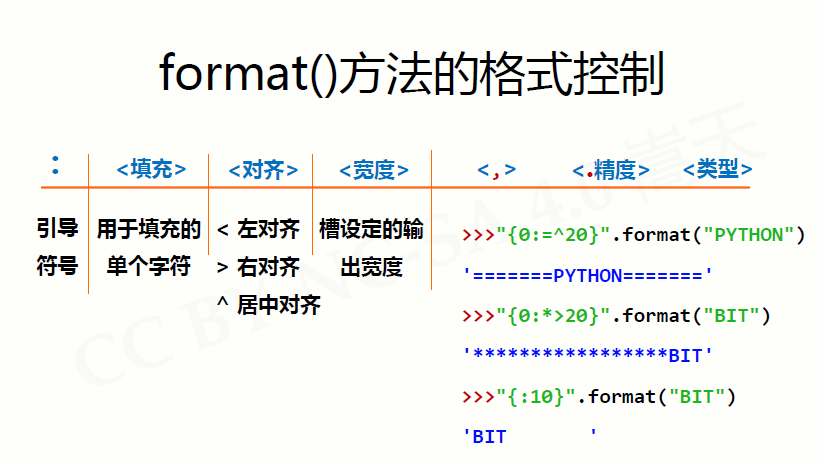

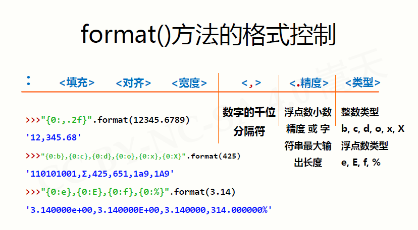

## 练习

'''获得用户输入的一个整数a，计算a的平方根，保留小数点后3位，并打印输出。‪‬‪‬‪‬‪‬‪‬‮‬‪‬‮‬‪‬‪‬‪‬‪‬‪‬‮‬‫‬‮‬‪‬‪‬‪‬‪‬‪‬‮‬‫‬‫‬‪‬‪‬‪‬‪‬‪‬‮‬‪‬‫‬‪‬‪‬‪‬‪‬‪‬‮‬‫‬‮‬‪‬‪‬‪‬‪‬‪‬‮‬‫‬‪‬
输出结果采用宽度30个字符、右对齐输出、多余字符采用加号(+)填充。‪‬‪‬‪‬‪‬‪‬‮‬‪‬‮‬‪‬‪‬‪‬‪‬‪‬‮‬‫‬‮‬‪‬‪‬‪‬‪‬‪‬‮‬‫‬‫‬‪‬‪‬‪‬‪‬‪‬‮‬‪‬‫‬‪‬‪‬‪‬‪‬‪‬‮‬‫‬‮‬‪‬‪‬‪‬‪‬‪‬‮‬‫‬‪‬如果结果超过30个字符，则以结果宽度为准。'''
a=int(input())
aa=pow(a,0.5
print("{:+>30.3f}".format(aa))

获得输入的一个字符串s，以字符减号(-)分割s，将其中首尾两段用加号(+)组合后输出。

b=input()
bb=b.split("-")
print("{}+{}".format(bb[0],bb[-1]))

## time库

时间获取：time(),ctime(),gmtime()

时间格式化：strftime(),strptime()

程序计时：sleep(),perf_counter()

| 函数       | 描述                                       |
| -------- | ---------------------------------------- |
| time()   | 获取当前时间戳，即计算机内部时间值，浮点数>>>time.time() 1970一月一个开始214354657.21343254 |
| ctime()  | 获取当前时间并以易读方式表示，返回字符串>>time.ctime() 'Fri Jan 26 12:11:16 2018 ' |
| gmtime() | 获取当前时间，表示为计算机可处理的时间格式time.gmtime()>>>time.struct_time(tm_year=2018,tm_mon=1,tm_mday=26,tm_hour=4,...) |

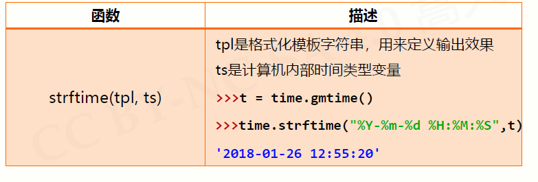

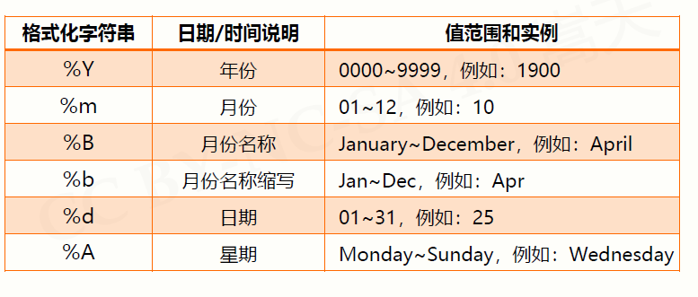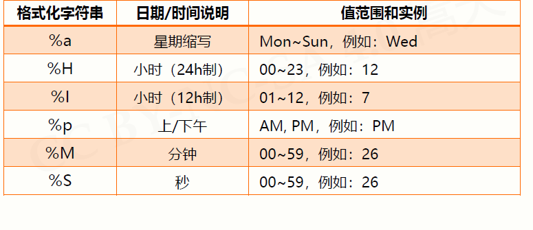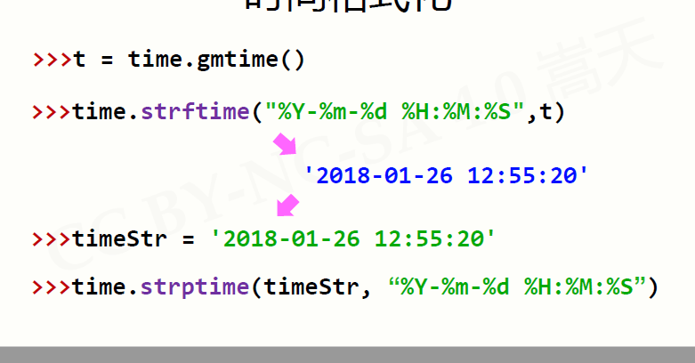

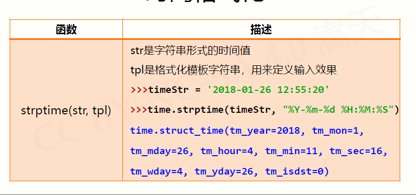

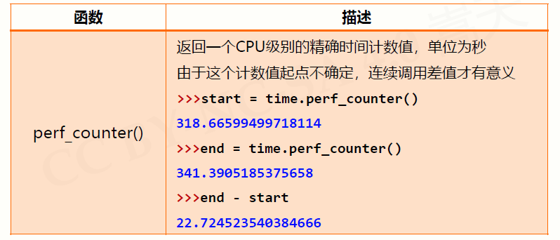

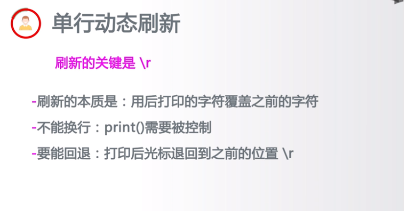

IDLE是开发环境 \r不服从换行

import time
for i in range(101):

    print("\r{:3}%".format(i),end="")
    time.sleep(0.1)
###### 文本进度条												

import time
scale =50

print("开始执行".center(scale//2,"-"))

start=time.perf_counter()

for i in range (scale+1):
    a='*'*i
    b='.'*(scale - i)
    c=(i/scale)*100
    dur=time.perf_counter()-start
    print("\r{:^3.0f}%[{}->{}]{:.2f}s".format(c,a,b,dur),end='')
    time.sleep(0.1)
print("\n"+"结束执行".center(scale//2,'-'))

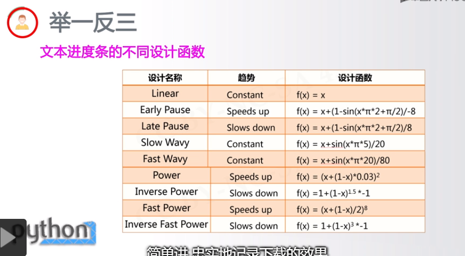

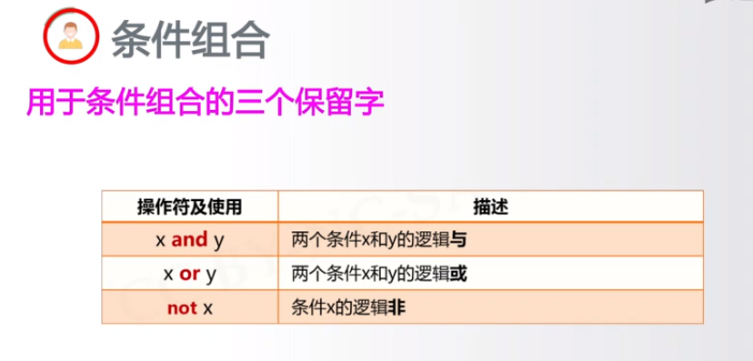

# 函数

###### 函数：IPO的实现，完整代码的封装

def <函数名>（<参数（0个或多个）>）

​	<函数体> 

​	return <返回值>

参数可有可无，可选，（<非可选参数>,<可选参数>）

函数定义是可以设计可变数量参数，既不确定参数总数量，(<参数>,*b)

参数调用时，参数可以按照位置或名称方式传递（m=5,n=10）

###### 函数的返回值

函数可以返回0个或多个结果

return可以有也可以没有

##### 局部变量和全局变量

1.局部变量和全局变量是不同变量局部变量是函数内部的占位符，与全局变量可能重名但不同，

函数运算结束后，局部变量被释放，可以使用global保留字在函数内部使用全局变量

2.局部变量为组合数据类型且未创建，等同于全局变量

n,s=10,100		n和s是全局变量

def fact(n):

    s=1
    global d 此处d是全局变量
    for i in range(1,n+1):
        s*=i	#fact（）函数中的n和s是局部变量
    return s
print("第四项结果为：",fact(n),s)#n和s是全局变量

2

ls=["F","f"]#通过[]正式创建一个全局变量ls
def func(a):

    ls.append(a)#此处是列表类型，未正式创建，则等同于全局变量
    return
func("C")#全局变量ls被修改
print(ls)

###### 阶乘

def jiecheng(n):
    s=1
    for i in range(1,n+1):
        s*=i
    return s//m #//整除
sum=int(input("请输入你所求的阶乘："))
print("你所求{0}的阶乘为{1}".format(sum,jiecheng(sum)))

###### 函数的返回值

def retu(n,m=1):
    s=1
    for i in range(1,n+1):
        s*=i
    return s//m,n,m
a,b,c=retu(10,5)
print("第三项结果为：",a,b,c)

##### 代码复用

函数和对象是代码复用的两种主要形式

函数：将代码命名在代码层面建立了初步抽象

对象：属性和方法<a>.<b>和<a>.<b>()在函数之上再次组织进行抽象

模块化设计

具体包括：主程序、子程序和子程序间的关系

子程序看作模块，主程序看做模块和模块之间的瓜你想

紧耦合：两个部分之间交流很多，无法独立存在

松耦合：两个部分之间交流较少，可以独立存在

模块内部之间紧耦合，模块之间松耦合

### 递归

函数定义中调用函数自身的方式就是递归

两个关键特征

n！={

​	1		#n=0

​	n(n-1)!	otherwise

}

链条：计算过程存在递归链条

基例：存在一个或多个不需要再次递归的基例

####递归的实现

函数+分支结构

递归链条

递归基例

def fact(n):
    if n==0:
        return 1
    else:
        return n*fact(n-1)#调用函数自身
print(fact(3))#当执行到fact(1)时，n=0，得到返回值1，然后就会返回给fact(1)这段函数

然后逐层向上返回1*1*2*3=6

1*fact(1)*fact(2)fact(3)

函数+分支语句

递归本身是一个函数，需要函数定义方式描述

执行过程，开辟内存，复制代码，再去计算

##### 斐波那契数列

F(n)=F(n-1)+F(n-2),F(n)等于前两项之和

斐波那契数列

def f(n):
    if n==1 or n==2:
        return 1#n=1,2返回1
    else:
        return f(n-1)+f(n-2)
print("斐波那契数列10",f(10))		#结果:55

##### 汉诺塔？？

三个圆柱

count=0
def hanoi(n,src,dst,mid):
    global count#全局变量
    if n==1:
        print("{}:{}->{}".format(1,src,dst))
        count+=1
    else:
        hanoi(n-1,src,mid,dst)
        print("{}:{}->{}".format(n,src,dst))
        count+=1
        hanoi(n-1,mid,dst,src)
hanoi(3,"A","C","B")
print("汉诺塔",count)

### Pyinstaller

(cmd命令行)pyinstaller -F <文件名.py>

-h 帮助

--clear清理临时文件

-D或者--onedir默认值，生成dist文件夹

-F在dist生成独立的打包文件

-i<图标文件.ico>制定打包程序的图标（icon）文件

 pyinstaller -i logo.ico -F sevendrawline7.py

### 组合数据及类型

### 1、集合类型及操作

集合是多个元素的无序组合；

集合：无序，唯一，不存在相同元素，不可更改，不可改变数据类型

（集合要求唯一，故要求不可变）

集合用{}表示，元素将用逗号隔开

建立集合类型用{}或set()

建立空集合类型，必须使用set()

A={'python',1241,('python',123)}	->{1241,'python',('python',123)}

B=set('pypy123')#使用set（）建立集合相同的p和y去掉  集合无序->{'1','p','2','3','y'}

C={‘python’,123,'python',123}		->{'python',123}

#### 集合间操作

S|T并	S-T差	S&T交	S^T补

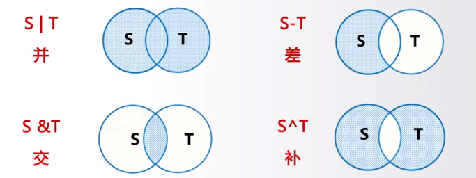

| 操作符及应用   | 描述                        |
| -------- | ------------------------- |
| S\|T并    | 返回一个新集合，包括在集合S和T中的所有元素    |
| S-T差     | 返回一个新集合，包括在集合S但不在T中的所有元素  |
| S&T交     | 返回一个新集合，包括同时在集合S和T中的所有元素  |
| S^T补     | 返回一个新集合，包括在集合S和T中非相同的所有元素 |
| S<=T或S<T | 返回True/False，判断S和T的子集关系   |
| S>=T或S>T | 返回True/False，判断S和T的包含关系   |

包含关系比较:

‘p’ in {'p','y',123}			->True

{'p','y'}	>={'p',"y",123}		False

### 4个增强型操作符

| 操作符及应用 | 描述                    |
| ------ | --------------------- |
| S\|=T  | 更新集合S，包括在集合S和T中的所有元素  |
| S-=T   | 更新集合S，包括在集合S但不在T中的元素  |
| S&=T   | 更新集合S，包括同时在集合S和T中的元素  |
| S^=T   | 更新集合S，包括在集合S和T中的非相同元素 |


### 集合处理方法

| 操作函数或方法      | 描述                               |
| ------------ | -------------------------------- |
| S.add(x)     | 如果x不在集合S中，将x增加到S                 |
| S.discard(x) | 移除S中元素x，如果x不在集合S中，不报错            |
| S.remove(x)  | 移除S中元素x，如果x不在集合中，产生KeyError异常    |
| S.clear()    | 移除S中所有元素                         |
| S.pop()      | 随即返回S的一个元素，更新S，若S为空产生KeyErrow异常  |
| S.copy()     | 返回集合S的一个副本                       |
| len(S)       | 返回集合S的元素个数                       |
| x in S       | 判断S中元素x，x在集合S中，返回True，否则返回False  |
| x not in S   | 判断S中元素x，x不在集合S中，返回True，否则返回False |
| set(x)       | 将其他类型变量x转变为集合类型                  |

##### 集合去重：集合类型所有元素无重复

ls=["p","y","p","y",123]

s=set(ls)	#利用了几何无重复元素的特点

{'p','y',123}

lt=list(s)	#将集合转换为列表

['p','y',123]

### 2、序列类型及操作

序列是具有先后关系的一组元素：元素类型可以不同，元素间由序号引导，通过下标访问序列的特定元素

序列是一个基类类型

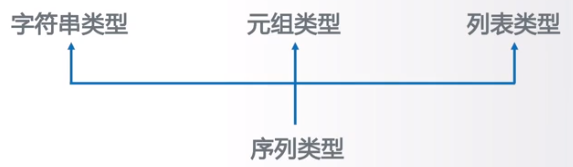

序列的定义：反向递减序号，正向递增序号

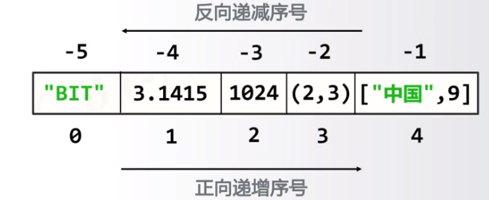

#### 序列类型通用操作符

###### 6个操作符

| 操作符及应用          | 描述·                         |
| --------------- | --------------------------- |
| x in s          | 如果x是序列s的元素，返回True，否侧返回False |
| x not in s      | 如果x是序列s的元素，返回False，否则返回True |
| s + t           | 连接两个序列s和t                   |
| s* n或n * s      | 将序列s复制n次                    |
| s[i]            | 索引，返回s中的第i个元素，i是序列的序号       |
| s[i:j]或s[i:j:k] | 切片，返回序列s中第i到j以k为步长的元素子序列    |

实例：

ls=['python',123,'io']

ls[::-1]		->['.io',123,'python']	

s='python1232.io'

s[::-1]		->['oi.321.nohtyp']

### 序列类型通用函数和方法

###### 5个函数和方法

| 函数和方法                     | 描述                        |
| ------------------------- | ------------------------- |
| len(s)                    | 返回序列s的长度                  |
| min(s)                    | 返回序列s的最小元素，s中元素需要可比较      |
| max(s)                    | 返回序列s的最大元素，s中元素需要可比较      |
| s.index(x)或s.index(x,i,j) | 返回序列s从i开始到j位置中第一次出现元素x的位置 |
| s.count(x)                | 返回序列s中出现x的总次数             |

ls=['python',123,'.io']

len(ls)		->3

s='pthon123.io'	

max(s)		->'y'	#字母序

### 元组类型定义（不能被修改）

##### 元组是序列类型的一种扩展，一旦创建就不能被修改，实用小括号()或tuple（）创建，元素将用逗号，分隔，可以使用或不会使用小括号

def func():

 	return 1,2#元组

creature='cat','dog','tiger'

creature		->('cat','dog','tiger')

color=(0x001100,'blue',creature)

color 		->(4352,'blue',('cat','dog','tiger'))

###### 元组继承序列类型的全部通用操作

creature='cat','dog','tiger'

creature[::-1] ->('tiger','dog','cat')  并不改变原有creature变量的值，而是生成一个新的元组值

color=(0x001100,'blue',creature)

color[-1][ 2\]	->tiger	# 由于creature又是一个元组类型故又可以使用索引

### 列表类型定义

列表类型创建后可以随意被修改，使用方括号[]或list()真正创建，元素间用逗号分隔，各元素类型可以不同，无长度限制

实例：

ls=['python',123,'io']

ls		->['python',123,'io']	

lt=ls							方括号[]真正创建一个列表，赋值仅传递引用

lt 		->['python',123,'io']	给同一个元组起了不同的名字，都指向同一个列表（内存，指针）

#### 列表类型操作函数和方法

| 函数或方法         | 描述                     |
| ------------- | ---------------------- |
| ls[i]=x       | 替换列表ls第i元素为x           |
| ls[i:j:k]=lt  | 用列表lt替换ls切片后所对应元素值列表   |
| del ls[i]     | 删除列表ls中第i元素            |
| del ls[i:j:k] | 删除列表ls中第i到第j以k为步长的元素   |
| ls+=lt        | 更新列表ls，将列表lt元素增加到列表ls中 |
| ls*=n         | 更新列表ls，其元素重复n次         |

实例

ls=['cat','dog','tiger',1024]

ls[1:2]=[1,2,3,4]		#将列表中第2个元素替换为1,2,3,4

['cat',1,2,3,4,'tiger',1024]

del ls[::3]		->[1,2,3,4,'tiger']		#删除以3为步长

ls*2				->[1,2,3,4,'tiger',1,2,3,4,'tiger']

### 列表类型操作函数和方法

| 函数或方法          | 函数                   |
| -------------- | -------------------- |
| ls.append(x)   | 在列表ls最后增加一个元素x       |
| ls.clear()     | 删除列表ls中所有元素          |
| ls.copy()      | 生产一个新列表，赋值ls中所有元素    |
| ls.insert(i,x) | 在列表ls的第i位置增加元素x      |
| is.pop(i)      | 将列表ls中第i位置元素取出并删除该元素 |
| ls.remove(x)   | 将列表ls中的元素反转          |

ls=['cat','dog','tiger',1024]

ls.append(1234)

['cat',1,2,3,4,'tiger',1024,1234]

ls.insert(3,'human')

['cat',1,2,3,4,'tiger',''human'',1024,1234]

ls.reverse()

[1234,1024,'human','tiger',1,2,3,4,cat',]

#### 序列类型应用场景

元组用于元素不改变的应用场景，更多用于固定搭配场景

列表更加灵活，最常用的序列类型

最重要的作用：表示一组有序数据，进而操作他们

##### 元素遍历:

for item in ls:			#列表

​	<语句块>

for item in tp:		#元组

​	<语句块>

##### 数据保护：

如果不希望数据被程序所改变，转换成元组类型

ls=['cat','dog',1024]

lt=tuple(ls)

print(lt)		->('cat','dog',1024)

#### python的位运算符：

(a & b)
按位与运算符：参与运算的两个值,如果两个相应位都为1,则该位的结果为1,否则为0
输出结果 12 ，二进制解释： 0000 1100

(a | b)
按位或运算符：只要对应的二个二进位有一个为1时，结果位就为1。
输出结果 61 ，二进制解释： 0011 1101

(a ^ b)
按位异或运算符：当两对应的二进位相异时，结果为1
输出结果 49 ，二进制解释： 0011 0001

(~a )
按位取反运算符：对数据的每个二进制位取反,即把1变为0,把0变为1 。~x 类似于 -x-1
输出结果 -61 ，二进制解释： 1100 0011，在一个有符号二进制数的补码形式。

a << 2
左移动运算符：运算数的各二进位全部左移若干位，由 << 右边的数字指定了移动的位数，高位丢弃，低位补0。
输出结果 240 ，二进制解释： 1111 0000

a >> 2
右移动运算符：把">>"左边的运算数的各二进位全部右移若干位，>> 右边的数字指定了移动的位数
输出结果 15 ，二进制解释： 0000 1111

##### python赋值运算符：

*= 乘法赋值运算符 c *= a 等效于 c = c * a
/= 除法赋值运算符 c /= a 等效于 c = c / a
%= 取模赋值运算符 c %= a 等效于 c = c % a
= 幂赋值运算符 c **= a 等效于 c = c ** a
//= 取整除赋值运算符 c //= a 等效于 c = c // a

#### 回文

 ###### 方法二: 将int转化成str类型: 双指针 (指针的性能一直都挺高的)
    def isPalindrome(x: int) -> bool:
        lst = list(str(x))
        L, R = 0, len(lst)-1
        while L <= R:
            if lst[L] != lst[R]:
                return  False
            L += 1
            R -= 1
        return True

。

class Solution:

​    def isPalindrome(self, x: int) -> bool:

​        ''' if x<0:	#字符串切片

​            return False

​        if str(x)[::-1]==str(x):

​            return True

​        else:

​            return False

​        '''	#整数整除回文

​     9回文

def isPalindrome(x):
     if (x<0) or (x%10==0 and x!=0):
          return print(False)
     revertedNumber=0
     while(x>revertedNumber):
          print(x)
          revertedNumber=revertedNumber*10+x%10
          x/=10
          if x==revertedNumber or x==revertedNumber/10:
               return print(False)
          else:
               return print(True)
isPalindrome(1290)

### 基本统计值

总个数：len()

求和:for ... in

平均值：求和/总个数

方差：各数据与平均数差的平方的和的平均数

中位数：排序、然后..奇数找中间1个，偶数找中间2个取平均

####实例CalStatisticsV1

def getNum(): #获取用户不定长度的输入
     nums=[]
     iNumStr=input("请输入数字(回车退出):")
     while iNumStr !="":
          nums.append(eval(iNumStr))
          iNumStr=input("请输入数字(回车退出):")
     return nums

def mean(numbers):#计算平均值
     s=0.0
     for num in numbers:
          s=s+num
     return s/len(numbers)

def dev(numbers,mean):#计算方差
     sdev=0.0
     for num in numbers:
          sdev=sdev+(num-mean)**2
     return pow(sdev/(len(numbers)-1),0.5)

def median(numbers):#计算中位数
     sorted(numbers)#排序 
     size=len(numbers)
     if size % 2==0:
          med=(numbers[size//2-1]+numbers[size//2])/2#//= 取整除赋值运算符 c //= a 等效于 c = c // a
     else:
          med=numbers[size//2]
     return med

n=getNum()
m=mean(n)
print("平均值:{},方差：{:.2f},中位数:{}.".format(m,dev(n,m),median(n)))

### 字典类型

“映射”：一种键（索引）和值（数据）的对应

set：value

字典类型是“映射”的体现；键值对：键思数据索引的扩展；字典是键值对的集合，键值队之间无序；采用大括号{}和dict()创建，键值对用冒号：表示

{<键1>：<值1>，<键2>：<值2>，<键n>：<值n>}

通过[]用来向字典变量中索引或增加元素

<字典变量>={<键1>：<值1>，<键2>：<值2>，<键n>：<值n>}

<值>=<字典变量>[<键>]	<字典变量>[<键>]=<值>

#### 字典类型的定义和使用

d={"中国":"北京","河南":"郑州"}

d["中国"]		->北京

de={};type(de)	#type(x)返回变量x类型

<class 'dict'>

#### 字典类型操作函数和方法

| 函数和方法              | 描述                            |
| ------------------ | ----------------------------- |
| del d[k]           | 删除字典d中键k对应的数据值                |
| k in d             | 判断键k是否在字典d中，如果在返回True，否则False |
| d.keys()           | 返回值点d中所有的键信息                  |
| d.values()         | 返回字典d中所有的值信息                  |
| d,items()          | 返回字典d中所有的键值对信息                |
| d.get(k,<default>) | 键k存在，则返回相应值，不在则返回<default>值   |
| d.pop(k,<default>) | 键k存在，则取出相应值,不在则返回<default>值   |
| d.popitem()        | 随机从字典d中取出一个键值对，以元组形式返回        |
| d.clear()          | 删除所有的键值对                      |
| len(d)             | 返回字典d中元素的字数                   |

d={"中国":"北京","河南":"郑州"}

“中国” in d

True

d.keys()

dict_keys(['中国','河南'])

d.values()

##### enumerate() 函数：

用于将一个可遍历的数据对象(如列表、元组或字符串)组合为一个索引序列，同时列出数据和数据下标，一般用在 for 循环当中。

```py
#CalHamletV1
def getText():
     txt=open("hamlet.txt","r").read()
     txt=txt.lower()#转换成小写
     for ch in '!"#$%&()*+,-./:;<=>?@[\\]^_‘{|}':
          txt=txt.replace(ch,"")#归一化文本
     return txt
hamletTxt=getText()
words=hamletTxt.split()					   #将字符串用空格分隔
counts={}
for word in words:
     counts[word]=counts.get(word,0)+1		#索引字典，如果在里面就返回次数，后面加1；如果不在就添加到字典，并且加1
items=list(counts.items())					#.item()转换成字典类型
items.sort(key=lambda x:x[1],reverse=True)	#.sort()	key=lambda x:x[1],reverse=True按照一个元素排序默认从小到大；reverse=True从大到小
for i in range(10):
     word,count=items[i]
     print("{0:<10}{1:5>}".format(word,count))

```


 


